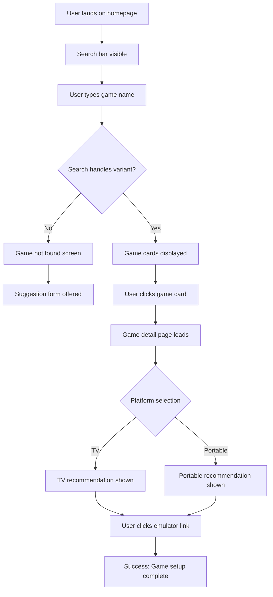
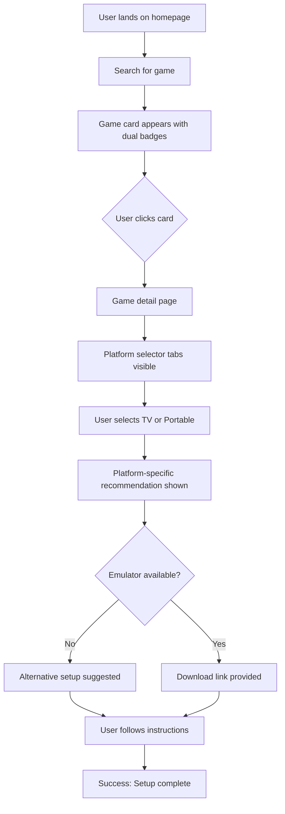

# UX Design Specification RetroGame Curator

**Author:** BMad
**Date:** 2026-04-04

---

<!-- UX design content will be appended sequentially through collaborative workflow steps -->

## Project Understanding

### Project Vision

RetroGame Curator delivers certainty to retro gaming enthusiasts by providing a single, trusted recommendation for how to play each classic game on modern systems. The product eliminates decision fatigue by cutting through fragmented forum discussions and outdated information, giving users confidence that they've found the best way to play.

**Core UX Principle:** Clarity over options. One definitive answer, not a list to parse.

### Target Users

**The Veteran Collector (30s-40s)**
- Owns original hardware collection
- Tech-savvy: understands emulators, patching, ROMs
- Wants portable access during commute without quality loss
- Values authenticity and proven setups
- Uses desktop for setup, mobile for play

**The New Convert (20s-30s)**
- Discovered retro gaming through streaming or friends
- Knows basic emulator concepts but overwhelmed by options
- Seeking trusted guidance without forum intimidation
- Mobile-first discovery, desktop for implementation

### Key UX Challenges

1. **Conveying certainty:** The recommendation must feel definitive, not provisional. Users need to trust they've found the best solution.

2. **Bridging knowledge gaps:** Users understand emulators but may not know about recent remasters, fan translations, or modern emulator improvements. Education must be seamless, not overwhelming.

3. **Emotional resonance:** Nostalgia-driven product needs modern UX that honors retro gaming culture without feeling dated.

4. **Dual-device workflow:** Recommendations must work seamlessly across desktop (downloading, patching, configuring) and mobile (actual gameplay).

### Design Opportunities

1. **The "That's it, then!" moment:** Instant clarity when users land on a game page and see the definitive answer—that's the core UX win.

2. **Community contribution as curation:** Make contributors feel like expert curators whose expertise is valued, not just submitters.

3. **Visual platform differentiation:** Clear, instant distinction between TV setups (resolution upscaling, controller config) vs. portable (touch controls, battery optimization).

4. **Trust signals:** Strong visual indicators that recommended resources are legitimate and safe—critical when directing users to download external software.

## Core User Experience

### Defining the Experience

The heart of RetroGame Curator is the **search → recommendation** flow. Users search for a game and instantly see the definitive "best way to play" answer. This single interaction defines the product's value—anything that adds friction or ambiguity fails the core promise.

**Core user action:** Search for a game title and view the platform-specific recommendation with resource links.

**Critical success:** Users find their answer in under 30 seconds with zero doubt.

### Platform Strategy

**Platform:** Web application (Astro + file-based JSON)

**Device considerations:**
- **Desktop:** Primary for research, downloading emulators, and configuration
- **Mobile:** Primary for on-the-go discovery during commute or gaming sessions
- **Responsive design:** Critical—both views must be equally functional

**Technical constraints:**
- Static site hosting (self-hosted on Raspberry Pi 5 or VPS)
- No offline functionality required for MVP
- No device-specific capabilities needed

### Effortless Interactions

**What should feel natural:**
- Search handles all query variants identically ("FF7", "Final Fantasy VII", "Final Fantasy 7")
- Platform distinction (TV vs. portable) is visually immediate
- Resource links are clearly categorized (emulator download, patch, config)

**Where users currently struggle:**
- Forums require parsing dozens of comments to find useful information
- No clear "best" answer—just competing opinions
- Outdated information with no freshness signals

**The delight factor:**
Roman numeral search working flawlessly. Users expect "Metal Gear Solid 3" and "MGS III" to work identically—and they do.

### Critical Success Moments

**The "this is better" moment:**
User searches for a game and sees one clear recommendation with actionable links—no forum diving, no second-guessing.

**When users feel successful:**
When they follow the recommendation and successfully set up the game on their device.

**Failure points:**
- Search not finding a game that should exist
- Broken resource links
- Ambiguous or conflicting platform recommendations

### Experience Principles

These principles guide all UX decisions:

1. **Search-first navigation:** The search bar is the hero—everything revolves around finding a game quickly and accurately.

2. **One-page answers:** All critical information (recommendation, platforms, resources) visible without excessive scrolling.

3. **Platform clarity:** TV vs. portable distinction is visually immediate through icons and layout, not buried in text.

4. **Trust through specificity:** Recommendations include exact emulator names, versions, and config details—not vague suggestions.

## Desired Emotional Response

### Primary Emotional Goals

**Certainty and Trust:** Users should feel confident they've found the best, safest way to play any retro game. This is the core emotional promise—no more second-guessing, no more forum uncertainty.

**Relief:** The product eliminates the frustration of sifting through outdated, conflicting information. Users feel the weight of decision-making lifted.

### Emotional Journey Mapping

**First discovery:** Curiosity mixed with hope—"finally, something that might actually work"

**During core experience:** Focus and clarity. Search → find → understand is a smooth, frictionless flow.

**After completing their task:** Accomplishment and excitement. They know their setup is optimal and are ready to play.

**If something goes wrong:** Understanding, not frustration. Clear guidance that helps them move forward.

**When returning:** Comfort and familiarity. They know where to go and trust what they'll find.

### Micro-Emotions

**Confidence vs. Confusion:** Critical. Users need to feel sure about their emulator choices and configurations.

**Trust vs. Skepticism:** Critical. They're downloading external software based on our links—this must feel safe and legitimate.

**Excitement vs. Anxiety:** The anticipation of playing a classic should be exciting, not fraught with "will this work?"

**Accomplishment vs. Frustration:** Emulation setup can be technical. We want users to feel capable, not stuck.

**Delight vs. Satisfaction:** Delight in discovery (new information), satisfaction in the result (working setup).

**Belonging vs. Isolation:** Community features should make them feel part of an enthusiast group, not alone in their hobby.

### Design Implications

**Building confidence and trust:**
- Use clear, authoritative language ("Best way to play" not "You could try")
- Show specific version numbers and config details
- Include trust signals (verified links, community contributions, last updated dates)
- Avoid hedging language that creates doubt

**Avoiding frustration:**
- Progressive disclosure—technical details available but not overwhelming upfront
- Clear error states when search finds nothing
- Helpful suggestions when games aren't found

**Creating moments of delight:**
- Roman numeral search working flawlessly
- Discovering unexpected information (fan translations, modern emulator improvements)
- Clean aesthetic that honors retro culture while feeling modern

**Establishing belonging:**
- Community contribution recognition
- Clear submission status tracking
- Acknowledgment of contributor expertise

### Emotional Design Principles

1. **Authoritative clarity:** Language and layout convey confidence, not ambiguity.

2. **Trust through transparency:** Users understand where information comes from and why they can rely on it.

3. **Respect for expertise:** Users know emulation—we don't dumb things down, we organize information intelligently.

4. **Nostalgia without kitsch:** Modern design that honors retro gaming culture without feeling dated or gimmicky.

5. **Frictionless accomplishment:** Every interaction should make users feel capable and successful.

## UX Pattern Analysis & Inspiration

### Inspiring Products Analysis

**Steam**
- **Core strength:** Visual-first browsing with community validation
- **UX highlights:** Cover art as primary anchor, clear information hierarchy, search handles partial matches well
- **Trust signals:** User reviews, achievement systems, community-driven recommendations
- **Transferable:** Card-based game listings, community validation through approvals, visual consistency

**EmuReady**
- **Core strength:** Niche expertise with direct, no-fluff content
- **UX highlights:** Platform-based organization, step-by-step clarity, respects user expertise
- **Trust signals:** Hyper-specific technical information, no ambiguity
- **Transferable:** Platform organization (TV vs. portable), authoritative presentation, respecting user knowledge

**GameNative**
- **Core strength:** Speed and visual discovery
- **UX highlights:** Minimal clicks to details, clean game cards, mobile-optimized
- **Trust signals:** Curated recommendations, consistent presentation
- **Transferable:** One-click discovery, mobile-first design, consistent card layout

### Transferable UX Patterns

**Navigation Patterns:**

1. **Search-first with visual fallbacks** (Steam) — Search is the hero, but cover art helps visual browsers discover games

2. **Platform-based organization** (EmuReady) — Clear separation of TV vs. portable setups, easy to scan

3. **Minimal-click discovery** (GameNative) — One click from search to full details, no extra navigation

**Interaction Patterns:**

1. **Card-based game listings** (Steam, GameNative) — Visual consistency, scannable at a glance

2. **Progressive disclosure** (Steam) — Basic info upfront, technical details available for those who want them

3. **Community validation** (Steam) — Approved submissions feel trusted and authoritative

**Visual Patterns:**

1. **Cover art as primary anchor** (Steam, GameNative) — Instant game recognition, emotional connection

2. **Color-coded platform indicators** (EmuReady) — TV vs. portable at a glance without reading

3. **Clean typography hierarchy** (All three) — Readable technical information without overwhelming

### Anti-Patterns to Avoid

1. **Forum clutter** — No threaded discussions, no nested comments. We deliver one answer, not options to parse.

2. **Information overload on cards** — Keep game listings scannable. Full details live on the game page.

3. **Ambiguous trust signals** — Clear indicators that recommendations are vetted and current.

4. **Desktop-first thinking** — Must work equally well on mobile for commuting users.

5. **Jargon without context** — Users know emulators, but not every term is universal. Define when helpful.

### Design Inspiration Strategy

**What to Adopt:**

- **Steam's cover art prominence** — Visual recognition is instant and creates emotional connection
- **EmuReady's platform organization** — Clear, scannable separation of TV vs. portable setups
- **GameNative's speed** — Search → result in one click, no extra navigation required

**What to Adapt:**

- **Steam's community features** — Simplified for our submission + approval model (no complex threads)
- **EmuReady's technical depth** — More specific recommendations (exact emulator versions), cleaner presentation
- **GameNative's mobile optimization** — Critical for our commuting user base, touch-friendly interactions

**What to Avoid:**

- **Steam's complexity** — We're simpler, more focused on one answer per game
- **Forum-style discussions** — Decision paralysis is the problem we're solving
- **Over-tagging** — Keep metadata focused on what matters for emulation (platform, emulator, config)

## Design System Foundation

### Design System Choice

**Tailwind CSS + Custom Components**

A utility-first CSS framework with incrementally built custom components tailored to RetroGame Curator's unique needs.

### Rationale for Selection

1. **Astro-native compatibility:** Tailwind + Astro is a proven, well-documented combination with zero runtime overhead.

2. **Single-operator friendly:** Utility-first approach is straightforward to maintain without deep design expertise.

3. **Visual uniqueness:** Complete control to create a modern aesthetic that honors retro gaming culture without feeling dated.

4. **Performance-first:** Small bundle sizes support our < 2 second page load requirement.

5. **Scalable component library:** Start with essential components (search, game cards, detail pages) and grow organically.

### Implementation Approach

**Phase 1 - Foundation:**
- Set up Tailwind with custom color palette (retro-inspired but modern)
- Define design tokens (spacing, typography, colors)
- Build core components: search bar, game card, platform badges

**Phase 2 - Page Templates:**
- Landing page with search hero
- Game listing page (grid of cards)
- Game detail page (recommendation + resources)
- Submission form

**Phase 3 - Polish:**
- Micro-interactions (hover states, transitions)
- Mobile-specific adjustments
- Accessibility audit

### Customization Strategy

**Brand-aligned customization:**
- Color palette: Modern dark theme with retro accent colors (neon greens, purples)
- Typography: Clean sans-serif for readability, retro-inspired headers where appropriate
- Visual hierarchy: Cover art prominence, clear platform indicators
- Emotional resonance: Subtle animations that evoke gaming nostalgia without kitsch

**Component strategy:**
- Reuse proven patterns from inspiration analysis (Steam cards, EmuReady organization)
- Custom styling for unique elements (platform badges, recommendation boxes)
- Consistent spacing and layout system across all pages

## 2. Core User Experience

### 2.1 Defining Experience

**"Search → Best Way to Play"**

The defining experience of RetroGame Curator is simple: users search for a game and instantly see the definitive "best way to play" recommendation with actionable resource links.

**This is what users will describe to friends:** "I found this site where you search for a retro game and it tells you exactly how to play it on your device."

**The core interaction:**
1. User types game name into search
2. System returns exact game (handling all query variants)
3. User clicks game card
4. Game detail page shows platform-specific recommendation with resource links

**If we nail this one interaction, everything else follows.**

### 2.2 User Mental Model

**How users currently solve this problem:**
- Google "[game] how to play on [device]"
- Browse Reddit threads (r/emulation, platform-specific subs)
- Check emulator forums
- Ask friends on Discord
- Watch YouTube tutorials

**Mental model expectations:**
- Fast search, relevant results
- Clear, direct answers (not forum threads to parse)
- Trustworthy sources with current information
- Everything needed in one place

**Pain points to address:**
- Conflicting recommendations across sources
- Outdated emulator versions with no freshness indicator
- Broken download links
- Generic advice without platform specificity

### 2.3 Success Criteria

**What makes users say "this just works":**
- Search returns the exact game they're looking for (handles variants automatically)
- One clear recommendation, no ambiguity or options to parse
- All resource links work and are current
- Platform-specific guidance is immediately obvious

**Success metrics:**
- < 30 seconds from search to actionable answer
- User feels confident they've found the best setup
- User successfully follows recommendation and gets game running

**Failure points:**
- Search not finding a game that should exist
- Broken or outdated resource links
- Ambiguous platform recommendations
- Information buried or hard to find

### 2.4 Novel UX Patterns

**Established patterns we're using:**
- Search-first navigation (Google, Steam)
- Card-based listings with cover art (Steam, GameNative)
- Detail pages with structured information (Wikipedia, IGDB)

**Our unique twists:**
- **Single authoritative answer** per game (not a list of options)
- **Platform-specific bifurcation** (TV vs. portable clearly separated with badges)
- **Community-vetted but admin-approved** (community submissions + expert oversight)

**This is mostly established patterns with focused presentation — users already understand the interaction model.**

### 2.5 Experience Mechanics

**Step-by-step flow for "Search → Best Way to Play":**

**1. Initiation:**
- User lands on homepage with prominent, centered search bar
- Placeholder text: "Search for a game (e.g., 'Final Fantasy VII')"
- User types game name

**2. Interaction:**
- Search handles all query variants: "FF7", "Final Fantasy 7", "Final Fantasy VII" all return same results
- Results show game cards with cover art, title, and platform tags
- User clicks their desired game

**3. Feedback:**
- Game detail page loads with clear visual hierarchy
- **Top section:** "Best Way to Play" recommendation with platform selector (TV / Portable tabs)
- **Middle section:** Emulator name, version number, configuration details, download links
- **Bottom section:** Alternative setups, unofficial patches, additional resources

**4. Completion:**
- User has all information needed in one scrollable view
- Clicks emulator download link, follows setup instructions
- Success = game running on their device

## Visual Design Foundation

### Color System

**Theme Direction: Modern Dark with Retro Accents**

A dark theme that honors retro gaming culture while feeling contemporary and premium.

**Primary Colors:**
- **Background:** Dark gray/black (#0a0a0a, #111111)
- **Surface:** Slightly lighter dark (#1a1a1a, #222222)
- **Text:** High contrast white/light gray (#ffffff, #e0e0e0)

**Accent Colors (Retro-inspired):**
- **Neon Green (#00ff88):** Success states, primary actions, "go" signals
- **Electric Purple (#9d4edd):** Brand personality, decorative elements
- **Warm Amber (#ffaa00):** Nostalgia cues, warnings, unofficial content

**Semantic Colors:**
- **Success (#00ff88):** Clear recommendations, verified links
- **Warning (#ffaa00):** Unofficial patches, alternative setups
- **Info (#4cc9f0):** Additional resources, contextual information
- **Error (#ff0066):** Broken links, outdated content

**Accessibility:** All color combinations meet WCAG AA contrast requirements.

### Typography System

**Tone:** Clean, readable, professional with subtle retro touches.

**Primary Typeface:** System sans-serif stack (Inter, SF Pro, Segoe UI, Roboto)
- Maximum compatibility and performance
- Excellent readability for technical information
- Modern, clean aesthetic

**Type Scale:**
- **H1 (3rem / 48px):** Page titles, hero text
- **H2 (2rem / 32px):** Section headers
- **H3 (1.5rem / 24px):** Card titles, subsections
- **Body (1rem / 16px):** Body text, descriptions
- **Small (0.875rem / 14px):** Meta information, captions

**Line Heights:**
- Headings: 1.2 (tight, modern)
- Body: 1.6 (readable)
- Technical text: 1.5 (monospace for emulator names/versions)

**Accessibility:** Minimum 16px body text, WCAG AA contrast compliance.

### Spacing & Layout Foundation

**Layout Philosophy:** Clean, uncluttered, scannable.

**Spacing System:** 8px base grid (Tailwind default)
- **4px:** Fine adjustments
- **8px:** Component padding
- **16px:** Section padding
- **24px:** Section margins
- **32px:** Major section breaks
- **48px:** Page-level spacing

**Grid System:**
- **Desktop:** 12-column grid, 1200px max-width container
- **Tablet:** 8-column grid, fluid width
- **Mobile:** 4-column grid, fluid width

**Layout Principles:**
1. **Search-first:** Prominent search bar on homepage (hero section)
2. **Visual hierarchy:** Cover art → title → platform recommendation → technical details
3. **Platform clarity:** TV vs. portable clearly separated with visual badges and sections

### Accessibility Considerations

- **Contrast:** All text meets WCAG AA (4.5:1 for normal text, 3:1 for large text)
- **Font sizes:** Minimum 16px body, scalable with browser settings
- **Focus states:** Clear visible focus indicators for keyboard navigation
- **Color independence:** Information not conveyed by color alone (icons + text)
- **Touch targets:** Minimum 44x44px on mobile
- **Responsive:** Tested at common breakpoints (320px, 768px, 1024px, 1440px)

## Design Direction Decision

### Design Directions Explored

Six complete design direction mockups were created and saved to `_bmad-output/planning-artifacts/ux-design-directions.html`:

1. **Classic Dark (Steam-inspired):** Traditional card layout with balanced information density and clear hierarchy
2. **Minimal Clean (GameNative-inspired):** Ultra-minimal with focus on cover art, less text, more visual
3. **EmuReady Technical (Information-Dense):** List-based layout with technical specs visible upfront
4. **Modern Bold (High Contrast):** Gradient hero, bold color blocks, premium feel
5. **Retro Modern (Nostalgic Accents):** Subtle retro color gradients with decorative elements
6. **Split Platform (TV vs Portable):** Platform-focused layout with side-by-side sections

### Chosen Direction

[To be selected based on exploration of the HTML showcase]

### Design Rationale

[To be documented after direction selection - why this direction works for RetroGame Curator's emotional goals and user needs]

### Implementation Approach

Based on the chosen direction, implementation will follow the Tailwind CSS + Custom Components strategy defined in the Design System Foundation section, with specific component styling adapted to match the selected visual direction.

## User Journey Flows

### 1. Sarah's Discovery Journey (Core Search Flow)

**Scenario:** Sarah, 24, discovers retro gaming through streaming. She wants to play Super Mario Bros on her phone but is overwhelmed by forum searches.

**Entry Point:** Homepage with prominent search bar

**Flow:**



**Optimizations:**
- Roman numeral conversion happens automatically (no user decision)
- Platform badges on game cards help users choose before clicking
- "Best Way to Play" section at top of detail page (no scrolling needed)

### 2. Marcus's Platform-Specific Journey

**Scenario:** Marcus, 38, has a hardware collection and wants portable access during commute.

**Entry Point:** Homepage → Search

**Flow:**



**Optimizations:**
- Platform badges (TV / Portable) visible on game cards
- Tabbed interface for TV vs Portable recommendations
- "Why this setup?" tooltip explains reasoning

### 3. User Suggestion Journey (Edge Case)

**Scenario:** User searches for a game that doesn't exist in the database.

**Entry Point:** Search results page (empty state)

**Flow:**

```mermaid
flowchart TD
    A[User searches for game] --> B{Game found?}
    B -->|Yes| C[Standard search flow]
    B -->|No| D[Empty state with message]
    D --> E["Game not found? Suggest it!" CTA]
    E --> F[User clicks suggestion button]
    F --> G[Suggestion form opens]
    G --> H[User fills: title, notes, optional email]
    H --> I[User submits]
    I --> J[Confirmation: "Pending review"]
    J --> K[Admin reviews submission]
    K --> L{Approved?}
    L -->|Yes| M[Game added to database]
    L -->|No| N[Submission rejected]
    M --> O[User notified via email]
    O --> P[Game now searchable]
    N --> Q[User notified of rejection]
```

**Optimizations:**
- Suggestion CTA prominent in empty state
- Form is simple: title + optional notes + optional email
- Submission status tracking (if email provided)
- Auto-email notification when game is approved

### Journey Patterns

**Navigation Patterns:**
1. **Search-first entry:** All journeys start at the homepage search bar
2. **Single-click discovery:** Game card → detail page (no intermediate steps)
3. **Progressive disclosure:** Basic info on cards, technical details on detail page

**Decision Patterns:**
1. **Platform selection:** TV vs Portable is always explicit (tabs or badges)
2. **Roman numeral handling:** Automatic, no user decision required
3. **Empty state handling:** "Not found" → suggestion form (no dead end)

**Feedback Patterns:**
1. **Success indicators:** Clear recommendation, working links, actionable next steps
2. **Error handling:** Helpful messages with recovery options
3. **Status updates:** Email notifications for submission workflow

### Flow Optimization Principles

1. **Minimize steps to value:** Search → answer in under 30 seconds
2. **Reduce cognitive load:** Automatic Roman numeral handling, clear platform badges
3. **Clear feedback:** "Best Way to Play" section is always visible first
4. **Delight moments:** Roman numeral search working perfectly, discovering new info
5. **Graceful error handling:** Empty states with suggestion forms, not dead ends

## Component Strategy

### Design System Components

**Available from Tailwind CSS:**
- Layout utilities (flex, grid, spacing)
- Typography (headings, body text, font weights)
- Color utilities (custom palette integration)
- Form elements (inputs, buttons, selects)
- Responsive breakpoints
- Animation/transitions

**Foundation Components (Tailwind-built):**
- Button variants (primary, secondary, outline)
- Input fields (search, text, email)
- Form elements (checkboxes, radios, selects)
- Grid layouts for game listings
- Modal/overlay utilities
- Navigation utilities

### Custom Components

#### 1. Game Card

**Purpose:** Display game information in a scannable, visually appealing format.

**Anatomy:**
- Cover art (aspect ratio 3:4 or 16:9)
- Game title (truncated if too long)
- Platform badges (TV, Portable, or both)
- Brief recommendation snippet (optional)

**States:**
- Default: Standard appearance
- Hover: Lift effect (translateY -4px), shadow increase
- Click: Active state with visual feedback

**Content Guidelines:**
- Cover art should be high-quality, consistent aspect ratio
- Title should be readable, handle long names gracefully
- Platform badges should be color-coded

**Interaction:** Click navigates to game detail page

#### 2. Platform Badge

**Purpose:** Visual indicator of platform support (TV vs Portable).

**Anatomy:**
- Small rounded pill shape
- Icon (TV or device)
- Label text ("TV" or "Portable")

**States:**
- TV: Primary color (green/teal)
- Portable: Accent color (amber/orange)
- Both: Stacked or side-by-side display

**Variants:**
- Small: Icon only (for dense layouts)
- Medium: Icon + text (standard cards)
- Large: Full badge with description (detail pages)

#### 3. Platform Selector Tabs

**Purpose:** Allow users to switch between TV and Portable recommendations on game detail pages.

**Anatomy:**
- Tab list with two options (TV / Portable)
- Active tab indicator (underline or background)
- Content area below showing selected platform's recommendation

**States:**
- Default: First tab active
- Hover: Cursor pointer, subtle background change
- Active: Distinctive styling with indicator
- Focus: Visible focus ring for keyboard navigation

**Interaction:** Click switches tab, content updates without page reload

#### 4. Recommendation Box

**Purpose:** Display the "Best Way to Play" recommendation with clear hierarchy.

**Anatomy:**
- Header: "Best Way to Play" with icon
- Platform label (TV or Portable)
- Emulator name (prominent, monospace font)
- Version number (if applicable)
- Configuration notes (optional)
- Resource links section (download, config, patches)

**States:**
- Default: Standard appearance
- Warning: For unofficial patches (amber accent)
- Verified: For admin-approved content (green checkmark)

**Content Guidelines:**
- Emulator name should be the most prominent text
- Links should be clearly labeled
- Version numbers should be in monospace

#### 5. Empty State (Game Not Found)

**Purpose:** Handle search results when game doesn't exist, with suggestion CTA.

**Anatomy:**
- Illustration or icon
- "Game not found" message
- Explanation text
- "Suggest this game" button
- Optional: Related games suggestions

**States:**
- Default: Standard empty state
- With suggestions: Shows related games below

**Interaction:** Button opens suggestion form

#### 6. Submission Form

**Purpose:** Allow users to suggest new games or updates.

**Anatomy:**
- Game title input (required)
- Alternative names (optional, comma-separated)
- Platform selection (checkboxes: TV, Portable)
- Emulator recommendations (repeater field)
- Notes field (optional)
- Email input (optional)
- Submit button
- hCaptcha or similar bot protection

**States:**
- Default: Empty form
- Error: Validation messages
- Submitting: Loading state
- Success: Confirmation message

**Validation:**
- Title required, non-empty
- At least one platform selected
- At least one emulator recommendation
- Email format if provided

### Component Implementation Strategy

**Approach:** Build custom components using Tailwind CSS utility classes with consistent design tokens.

**Principles:**
1. Reuse Tailwind utilities for layout, spacing, colors
2. Create component classes that combine utilities into reusable patterns
3. Use CSS custom properties (variables) for design tokens
4. Ensure accessibility (ARIA labels, keyboard navigation, focus states)
5. Mobile-first responsive design

**Naming Convention:**
- Component classes use BEM-like naming: `.game-card`, `.platform-badge`
- States use Tailwind modifiers: `.game-card:hover`, `.game-card--active`
- Variants use modifier classes: `.platform-badge--tv`, `.platform-badge--portable`

### Implementation Roadmap

**Phase 1 - Core Components (MVP):**
- Game Card - needed for homepage and search results
- Platform Badge - needed on game cards and detail pages
- Recommendation Box - needed for game detail pages
- Search Bar - needed for homepage and search functionality
- Empty State - needed for search edge cases

**Phase 2 - Supporting Components:**
- Platform Selector Tabs - needed for game detail pages
- Submission Form - needed for community contributions
- Game Detail Page Layout - composite component for detail views
- Footer and Header - needed for site structure

**Phase 3 - Enhancement Components:**
- Loading Skeletons - needed for perceived performance
- Toast Notifications - needed for form feedback
- Pagination - needed for large game lists
- Filter/Sort Controls - needed for advanced browsing (v2.0+)

## UX Consistency Patterns

### Button Hierarchy

**When to Use:**
- Primary buttons for main actions (submit, search, download)
- Secondary buttons for supporting actions (cancel, back)
- Tertiary buttons for low-priority actions (close, dismiss)

**Visual Design:**
- Primary: Background color (primary/neon green), white text
- Secondary: Outline style with primary border
- Tertiary: Text-only with hover underline

**Behavior:**
- Primary buttons are most prominent (larger, more saturated color)
- Only one primary action per screen section
- Focus ring visible on keyboard navigation

**Accessibility:**
- Minimum 44x44px touch target
- Visible focus state (2px ring)
- ARIA labels for icon-only buttons

**Variants:**
- Default: Standard appearance
- Loading: Spinner overlay, disabled state
- Disabled: Reduced opacity, no interaction

### Feedback Patterns

**Success Feedback:**
- Green checkmark icon
- "Success" or positive confirmation message
- Appears as inline validation or toast notification
- Auto-dismisses after 3 seconds (toasts)
- Dismissible by user

**Error Feedback:**
- Red X icon
- Clear error message explaining the problem
- Inline for form validation
- Toast for action failures
- Suggests next steps or solutions

**Warning Feedback:**
- Amber warning icon
- Message explaining potential consequences
- Requires user acknowledgment
- Appears as modal or prominent inline message

**Info Feedback:**
- Blue info icon
- Contextual guidance or tips
- Non-blocking, dismissible
- Used for helpful hints

**Accessibility:**
- ARIA live regions for dynamic feedback
- Color + icon + text (not color alone)
- Sufficient contrast ratios

### Form Patterns

**Input Validation:**
- Real-time validation for email format
- On-blur validation for required fields
- On-submit validation for all fields
- Error messages appear below input field
- Form cannot submit with errors

**Required Fields:**
- Asterisk (*) indicator next to label
- Clear error message when omitted
- Field remains focused after error

**Optional Fields:**
- No asterisk
- Placeholder text provides guidance
- No validation on submit

**Button States:**
- Submit button disabled until valid
- Loading spinner during submission
- Success/error feedback after submission

**Accessibility:**
- Labels associated with inputs via `for` attribute
- Error messages linked via `aria-describedby`
- Keyboard navigable form controls
- Focus order matches visual order

### Navigation Patterns

**Primary Navigation:**
- Search bar always visible (homepage)
- Breadcrumbs on detail pages
- Back button on all pages (browser back or UI back)

**Secondary Navigation:**
- Footer links (Terms, Privacy, Contact)
- Admin links (only visible to authenticated users)

**Internal Navigation:**
- Platform tabs on game detail pages
- Pagination for game lists
- Filter/sort controls (v2.0+)

**Accessibility:**
- Skip to main content link
- Clear page titles
- Focus indicators on all links
- ARIA landmarks for regions

### Search Patterns

**Search Behavior:**
- Real-time suggestions (v2.0+)
- Roman numeral conversion automatic
- Case-insensitive matching
- Partial match support

**Empty State:**
- "No results found" message
- "Suggest this game" CTA
- Related games suggestions (optional)

**Results Display:**
- Game cards in grid layout
- Platform badges visible
- Click navigates to detail page

**Accessibility:**
- Search input has clear label
- Results count announced
- Keyboard accessible suggestions

### Empty State Patterns

**No Search Results:**
- Icon or illustration
- "Game not found" message
- "Suggest this game" primary button
- Optional: "Try a different search" link

**Empty Submission Queue:**
- Icon illustration
- "No pending submissions" message
- "Submit a game" button

**Accessibility:**
- Descriptive heading for screen readers
- Actionable CTA with clear text

### Loading State Patterns

**Skeleton Screens:**
- Gray placeholder shapes matching content layout
- Subtle animation (pulse effect)
- Replaced with actual content when loaded

**Inline Loading:**
- Spinner within button or action area
- Text changes to "Loading..."
- Action disabled during loading

**Accessibility:**
- ARIA live region announces loading state
- Screen reader announces "loading"
- Keyboard users aware of waiting state

### Pattern Implementation Notes

**Consistency Rules:**
1. All buttons follow hierarchy (primary, secondary, tertiary)
2. All feedback uses appropriate pattern (success/error/warning/info)
3. All forms validate on blur and submit
4. All navigation has clear path back
5. All empty states offer next action

**Mobile Considerations:**
- Larger touch targets (44x44px minimum)
- Stacked layouts on small screens
- Tab bars for primary navigation on mobile
- Swipe gestures for common actions (v2.0+)

**Desktop Considerations:**
- Keyboard shortcuts (Ctrl+F for search)
- Hover states for interactive elements
- Tooltip for additional context
- Multi-column layouts

## Responsive Design & Accessibility

### Responsive Strategy

**Desktop Strategy (1024px+):**
- 4-column game grid for maximum content density
- Side-by-side platform recommendations (TV | Portable tabs)
- Hover states for interactive elements
- Keyboard shortcuts (Ctrl+F for search focus)
- Multi-column footer with expanded links

**Tablet Strategy (768px - 1023px):**
- 2-column game grid for balanced content
- Touch-optimized tab navigation for platform selection
- Simplified header with condensed navigation
- Swipe gestures for game card navigation (v2.0+)

**Mobile Strategy (320px - 767px):**
- Single-column game cards (full width)
- Stacked platform sections (TV first, then Portable below)
- Bottom navigation bar for key actions (Search, Submit, Menu)
- Touch-friendly 44x44px minimum targets
- Hamburger menu for secondary navigation

**Mobile-First Approach:**
- Design starts with mobile constraints
- Progressive enhancement for larger screens
- Critical content prioritized for small screens
- Touch interactions optimized before hover states

### Breakpoint Strategy

**Breakpoints:**
- `sm` (640px): Small mobile to large mobile
- `md` (768px): Tablet portrait
- `lg` (1024px): Tablet landscape / Small desktop
- `xl` (1280px): Desktop
- `2xl` (1536px): Large desktop

**Layout Changes:**
- Game grid: 1 col (mobile) → 2 cols (tablet) → 4 cols (desktop)
- Header: Condensed on mobile, full on desktop
- Platform selector: Stacked on mobile, tabs on desktop
- Footer: Single column (mobile) → Multi-column (desktop)

### Accessibility Strategy

**WCAG Level AA Compliance:**
- Color contrast ratios: 4.5:1 for normal text, 3:1 for large text (18px+)
- All interactive elements keyboard accessible
- Focus indicators visible and clear (2px ring)
- Screen reader compatibility with semantic HTML
- ARIA labels for icon-only buttons
- Skip to main content link for keyboard users

**Key Accessibility Features:**
- Semantic HTML structure (header, nav, main, footer, article)
- ARIA live regions for dynamic content (search results, form feedback)
- Focus management for modals and dynamic content
- High contrast mode support
- Text scaling up to 200% without breaking layout

**Touch Target Requirements:**
- Minimum 44x44px for all touch targets
- Adequate spacing between interactive elements
- Clear visual feedback on touch

### Testing Strategy

**Responsive Testing:**
- Real device testing on iOS and Android phones/tablets
- Browser testing: Chrome, Firefox, Safari, Edge
- Network throttling for mobile performance
- Orientation changes (portrait/landscape)

**Accessibility Testing:**
- Automated tools: axe-core, Lighthouse accessibility audit
- Screen reader testing: VoiceOver (macOS/iOS), NVDA (Windows), TalkBack (Android)
- Keyboard-only navigation testing
- Color blindness simulation (deuteranopia, protanopia, tritanopia)
- Focus order validation

**User Testing:**
- Include users with disabilities in usability testing
- Test with diverse assistive technologies
- Validate with actual target devices (commuting scenarios)

### Implementation Guidelines

**Responsive Development:**
- Use relative units (rem, em, %, vw, vh) over fixed pixels
- Implement mobile-first media queries (min-width breakpoints)
- Test touch targets and gesture areas
- Optimize images with srcset for different devices
- Lazy load images below fold

**Accessibility Development:**
- Semantic HTML structure (proper heading hierarchy)
- ARIA labels and roles where HTML semantics insufficient
- Keyboard navigation implementation (Tab, Enter, Escape)
- Focus management and skip links
- High contrast mode support (prefers-contrast media query)
- Reduced motion support (prefers-reduced-motion)

**Performance Considerations:**
- Critical CSS inline for above-fold content
- Defer non-critical JavaScript
- Optimize images (WebP format, proper sizing)
- Minimize bundle size for mobile users
- Cache static assets aggressively

---

# UX Design Workflow Complete

**UX Design Specification for RetroGame Curator is now complete!**

**Deliverables:**
- **UX Design Specification:** `_bmad-output/planning-artifacts/ux-design-specification.md`
- **Design Direction Mockups:** `_bmad-output/planning-artifacts/ux-design-directions.html`

**Next Steps:**
1. Review and select design direction from the HTML mockups
2. Create wireframes based on chosen direction
3. Build interactive prototypes for user testing
4. Proceed to technical architecture with UX context

**Workflow completed on:** 2026-04-04
